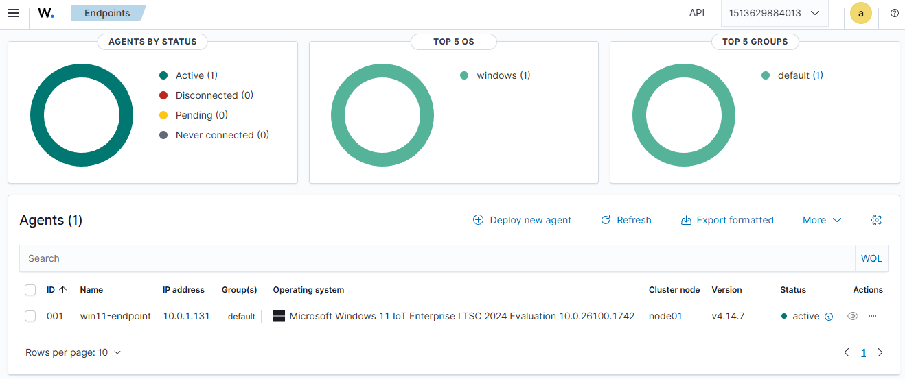
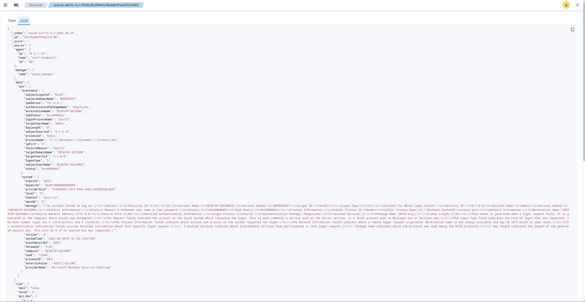

# SOC Home Lab con Wazuh SIEM (Docker)

Laboratorio casero de ciberseguridad orientado a simular el rol de un
**analista SOC**: monitoreo, detección y threat hunting sobre un
endpoint real, usando **Wazuh** como plataforma SIEM.

Este proyecto no busca ser solo "un SIEM instalado" — el objetivo es
documentar el proceso completo de un analista: levantar la
infraestructura, conectar un endpoint, validar una detección de punta
a punta, y (en fases futuras) simular ataques reales, crear reglas
custom y mapear todo a MITRE ATT&CK.

## Objetivo del proyecto

Demostrar, con evidencia real y reproducible, habilidades prácticas de:

- Despliegue y administración de un SIEM (Wazuh)
- Monitoreo de endpoints (Windows)
- Detección de eventos de seguridad mediante reglas nativas
- Threat hunting básico sobre logs
- (Fases futuras) Simulación de ataques, reglas custom, IDS de red,
  FIM, threat intelligence y documentación de kill chain completo

## Arquitectura

| VM              | Rol                          | IP (VMnet10) | SO                                          |
|------------------|-------------------------------|--------------|----------------------------------------------|
| wazuh-server     | Wazuh Manager (Docker)        | 10.0.1.130   | Ubuntu Server                                 |
| win11-endpoint   | Endpoint monitoreado           | 10.0.1.131   | Windows 11 IoT Enterprise LTSC Evaluation     |
| kali-linux       | Máquina atacante (Fase 2+)     | —            | Kali Linux                                    |

Red del lab: **VMnet10** (10.0.1.0/24), aislada, con NAT adicional en
cada VM para acceso a internet (actualizaciones, descargas de
paquetes). El tráfico de red del lab nunca se mezcla con el tráfico de
NAT.

> El diagrama detallado de arquitectura está en
> [`docs/architecture.md`](docs/architecture.md).

## Stack usado

- **SIEM:** Wazuh 4.14.7 (despliegue Docker, single-node)
- **Virtualización:** VMware Workstation
- **Manager:** Ubuntu Server
- **Endpoint:** Windows 11 IoT Enterprise LTSC Evaluation
- **Próximamente:** Kali Linux, Sysmon, Suricata

## Cómo se levantó el entorno (resumen)

1. VM Ubuntu Server con doble adaptador de red (NAT + VMnet10)
2. Instalación de Docker y Docker Compose
3. Clonado del repo oficial `wazuh-docker` (rama `v4.14.7`, single-node)
4. Generación de certificados y `docker compose up -d`
5. Verificación del Dashboard en `https://10.0.1.130`
6. VM Windows 11 configurada en inglés (US) — requisito para que el
   Security Event Log sea compatible con las reglas nativas de Wazuh
7. Despliegue del agente Wazuh desde el propio Dashboard (Deploy new
   agent) y arranque del servicio (`NET START Wazuh`)
8. Validación de una detección real: múltiples intentos de login
   fallido en Windows → capturados como eventos `4625` → clasificados
   por Wazuh con la regla nativa `60122` ("Logon Failure - Unknown
   user or bad password")

El proceso completo, incluyendo los problemas encontrados y cómo se
resolvieron, está documentado en
[`docs/troubleshooting.md`](docs/troubleshooting.md).

## Evidencia

**Agente activo en el Dashboard:**

**Alerta generada (detalle del evento):**

El JSON crudo del evento está disponible en
[`evidence/alerta-generada.json`](evidence/alerta-generada.json).

La alerta corresponde al **Event ID 4625** de Windows (logon fallido),
clasificado por Wazuh bajo la **regla 60122** (nivel 5), mapeada
automáticamente a **MITRE ATT&CK** (T1531 — Account Access Removal /
táctica Impact) y a marcos de compliance como PCI DSS, HIPAA, NIST
800-53 y GDPR.

## Próximos pasos

- **Fase 2:** Instalar Sysmon en el endpoint, simular ataques desde
  Kali Linux (fuerza bruta con Hydra, PowerShell ofuscado en Base64) y
  crear reglas custom mapeadas a MITRE ATT&CK
- **Fase 3:** Integrar Suricata para detección a nivel de red
- **Fase 4:** File Integrity Monitoring (FIM), integración con
  VirusTotal, CIS Benchmark
- **Fase 5:** Documentación completa de un escenario tipo "kill chain"
  con mapeo MITRE ATT&CK y recomendaciones de mitigación

---

*Proyecto en construcción activa — el README se actualizará conforme
avancen las siguientes fases.*